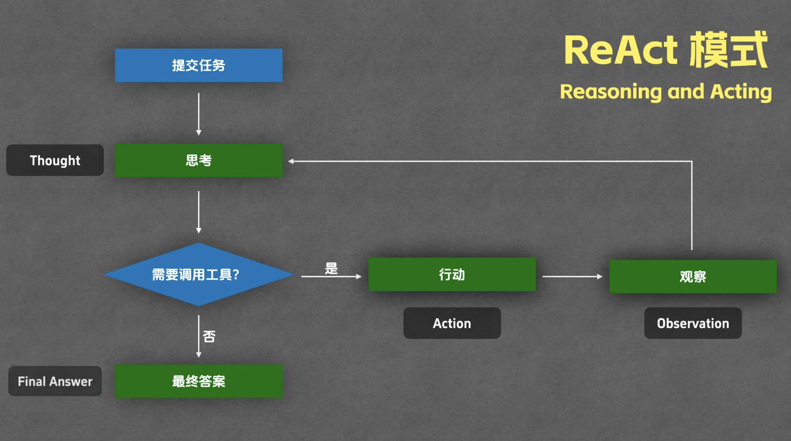

# AI Agent 应用开发学习复盘

**引言：**
这段时间的学习主要围绕两个方向展开：一是 AI Agent 应用开发，二是 Python 后端开发。前者让我理解大模型能力如何从简单问答走向任务规划和工具调用，后者让我理解一个 AI 应用如何被封装成稳定、可访问、可维护的真实服务。

在学习 Agent 的过程中，我也逐渐意识到，Agent 的优势在于它具备更强的主动性，能够根据目标进行规划、调用工具并执行任务。但与此同时，Agent 的主动性越强，使用者自身的控制感和参与感也可能被削弱，所以在设计 Agent 应用时，需要有清晰的能力边界和安全边界。

Agent 走向大众视野，意味着人工智能不再只是一个被动问答工具，而是开始成为可以参与任务规划、信息处理和实际执行的生产力工具。或许真的意味着人工智能从触碰到普通人的生活边界，开始转向成为水和电那样真正日常不可或缺的资源。
## 一、AI Agent

### 1. LLM、RAG、Agent 的关系

刚开始接触到agent这个概念，构建起对 LLM / Agent 的认知：

- 先理解了 LLM 的基本工作方式
	- 是基于已有训练结果和当前上下文，持续预测最可能出现的内容。
- 大模型应用不只是简单聊天，有Embedding、Copilot、Agent 三种交互形态。
- Agent 是把模型、工具和任务流程组织起来完成目标的应用形态。
	- LLM 是大脑，是构建起复杂AI系统的基础
	- RAG 是外部知识增强，从外部知识库中检索相关内容，再交给 LLM 生成更可靠的回答
	- Agent基于 LLM 和工具，感知环境、规划任务、执行动作

> 从 AI 到 Agent / Agentic 的变化，本质上是从“模型被动响应”走向“系统主动规划和执行”。

### 2. 从 AI Workflow 到 AI Agent

第一阶段 大语言模型（LLM）
- 基于LLM的训练数据，但受限于对专业知识了解有限
- passive，等待输入，然后响应
现在流行的这些主流聊天机器人就是基于LLM产出回应的

第二阶段 ai workflows
ai需要遵行的固定的流程，预先被设定好的workflow
- 这里可以提供给LLM遵行的skills或者说限制prompt
- 也可能涉及从外部调用工具
- 人为设定LLM的工作路径， 纠错和调整的过程需要人来负责完成

第三阶段AI Agents
思考和推理 由人转向被LLM替代，这也是从普通的workflow转向agent的关键所在。
这里不得不引入一种构建agent的模式：
- **ReAct** Reasoning and Act 

普通大模型本身无法感知外部环境，也不能直接改变外部状态；而 Agent 的核心区别在于，它可以通过工具读取外部信息、执行动作，并根据结果继续调整下一步。

### 3. Prompt 与 Agent 行为控制

关于提示词 Prompt 包含：
- 系统提示词
	- 系统提示词一般会包含对于模型角色的设定，期望的回答，包括格式、涵盖的内容方面以及一些事例等等。好的系统提示词可以大大提升agent的质量。
	- 一般在做系统的时候会放进skills里面。
- 用户提示词（也就是用户的问题）
然后一起打包发送给LLM

## 二、LangChain / LangGraph：Agent 工程化框架

在建立了对 LLM、RAG、Agent 的基础认知之后，我开始进一步理解：如果要真正开发一个 Agent 应用，不能只停留在“调用一次大模型 API”的层面，需要一个框架来组织模型、提示词、工具、上下文、检索和执行流程。

LangChain 和 LangGraph 就是在这个阶段接触到的两个重要框架。有效的把 Agent 从一个概念，逐步理解成一个可以工程化实现的系统。

### 1. 为什么需要 LangChain

最开始调用大模型时，流程通常很简单：

用户输入 → 调用模型 → 返回结果

这种方式适合简单问答，但当应用变复杂后，就会遇到很多问题：

- 提示词越来越多
- 模型调用逻辑越来越复杂
- 需要接入外部工具
- 需要保存多轮对话上下文
- 需要从知识库或代码库中检索资料
- 需要控制模型输出格式
- 需要把多个步骤组合成一个完整流程

如果把这些功能的实现逻辑全部堆砌，和核心的业务逻辑混合，后续的维护和修改难度会很大。

所以我对 LangChain 的理解是：

LangChain 的作用，是把大模型应用中常见的能力抽象成可组合的模块，让开发者可以更方便地组织模型、Prompt、工具、记忆、检索和输出解析。

它解决的是“如何把模型能力高效接入真实应用”的问题。

### 2. LangChain 的核心组件

 Agent 应用拆成几个核心组成。

首先是**模型**。模型是 Agent 的基础能力来源，负责理解用户问题、生成回答、判断下一步操作。

其次是 **Prompt**。Prompt 用来控制模型的行为，包括系统提示词和用户提示词。系统提示词一般用于设定模型角色、任务边界、回答格式和行为规则；用户提示词就是用户当前提出的问题。

然后是**工具**。工具让 Agent 具备和外部世界交互的能力。普通大模型只能根据上下文生成回答，而接入工具之后，Agent 可以读取文件、搜索代码、查询数据库、调用 API，甚至分析报错。

接着是 **Agent**。Agent 可以理解为模型和工具结合后的执行系统。模型负责理解和判断，工具负责执行具体动作，Agent 负责把两者组织成一个完整的任务流程。

还有**记忆**。记忆用于支持多轮对话，让 Agent 能够记住前面的上下文，而不是每次都像重新开始。

最后是 **RAG**，也就是检索增强生成。RAG 可以让模型先从外部知识库、文档或代码库中检索相关内容，再基于检索结果生成回答。
对于 RopeMind 这样的项目来说，这一点非常重要，因为它需要基于真实代码文件回答用户的问题。

### 3. Tool Calling 与 Agent 执行流程

Tool Calling 是 Agent 能够真正“做事”的关键。

普通大模型的流程通常是：

```
用户提问 → 模型生成回答
```

而 Agent 的流程是：
```markdown
用户提出目标  
↓  
模型理解任务  
↓  
判断是否需要工具  
↓  
选择合适的工具  
↓  
调用工具  
↓  
观察工具返回结果  
↓  
继续推理  
↓  
生成最终回答
```

这里的核心变化是：模型不再只是一次性回答，而是可以进入一个“思考、行动、观察、再思考”的循环。

这也对应着 ReAct 的思想：
Reasoning + Act  

以 RopeMind 为例，如果用户问“这个项目的登录逻辑在哪里”，Agent 不应该直接凭空回答，而应该先搜索相关代码，再读取对应文件，最后结合真实代码位置给出回答。

所以我对 Tool Calling 的理解是：

Tool Calling 让 Agent 从“语言生成系统”变成了“任务执行系统”。

它把大模型的理解能力，连接到了外部工具、代码文件、数据库、API 和运行环境上。

### 4. LangGraph 的作用：把 Agent 流程变成可控状态图

在理解 LangChain 之后，我进一步认识到：当 Agent 流程变复杂时，只靠工具调用还不够，还需要一种更清晰的方式来管理整个执行过程。

真实的 Agent 应用往往不是一条简单直线，而是会出现多个步骤、条件分支、循环执行、人工确认、报错重试等情况。

这时候 LangGraph 的作用就体现出来了。

LangGraph 是用“状态图”的方式来组织 Agent 流程，让 Agent 的执行过程更清晰、更可控。

把一个复杂任务拆成：

- **State**：当前任务状态
- **Node**：每一步要执行的动作
- **Edge**：步骤之间如何流转

比如 RopeMind 的流程可以理解成：
```
接收 GitHub URL  
↓  
克隆仓库  
↓  
扫描目录  
↓  
读取关键文件  
↓  
分析技术栈  
↓  
生成项目理解报告  
↓  
根据用户问题检索代码  
↓  
生成回答或二次开发方案
```

如果进入二次开发阶段，还可以继续扩展成：
```
分析修改需求  
↓  
检索相关文件  
↓  
判断影响范围  
↓  
生成修改计划  
↓  
等待用户确认  
↓  
应用修改  
↓  
运行测试  
↓  
读取报错并继续 Debug
```

所以，LangChain 的功能是提供 Agent 需要的基础能力组件，比如模型、Prompt、工具、记忆和检索；而 LangGraph 更像是组装这些组件，来控制 Agent 的执行流程，让整个过程更稳定、清晰，更容易维护。

---

## 总结

这次学习建立了一条 **AI Agent 应用开发** 主线：

- **认知层**：从 LLM / RAG / Agent 基础关系，到 Embedding / Copilot / Agent 三种应用形态的区分
- **执行层**：从 ReAct 模式的「思考 → 行动 → 观察」循环，到 Tool Calling 让模型从"语言生成"变成"任务执行"
- **工程化层**：用 LangChain 抽象模型 / Prompt / 工具 / 记忆 / 检索；用 LangGraph 把复杂流程变成可控的状态图

光理解概念不够，真正能跑起来、要靠"框架 + 状态管理"。

Python 后端那部分见 [[Python 后端学习复盘]](/guide/后端开发/AI%20Agent后端/Python%20后端学习复盘)，它讲的是怎么把 Agent 能力封装成稳定的服务。
