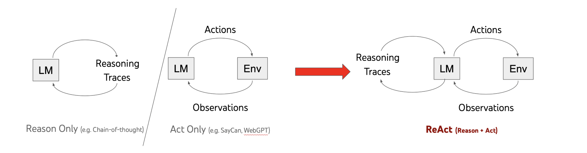

# ReAct

在 ReAct 之前，推理和行动是两条独立的 LLM 路线，Reason Only（CoT）做推理、Act Only（WebGPT / SayCan）调工具。ReAct 把两者合到同一个循环里。


> ReAct 通过与简单的维基百科 API 交互，克服了链式推理中普遍存在的**幻觉和错误传播**问题，并生成了比没有推理轨迹的基线模型更易于解释的、更接近人类的任务解决轨迹。

—— Yao et al., 2022，《[ReAct: Synergizing Reasoning and Acting in Language Models](https://arxiv.org/abs/2210.03629)》

在这个模式下，可以通过调整。

最终给到open ai 的就是这样的一个json：
```json
{
 "messages":[
   {
    "role":"system",
    "name":"scenario",
    "content":"剧本设定"
   },
   {
    "role":"system",
    "name":"author_dlc",
    "content":"作者DLC"
   },
   {
    "role":"system",
    "name":"mod",
    "content":"MOD规则"
   },
   {
    "role":"system",
    "name":"memory",
    "content":"记忆状态"
   },
   {
    "role":"user",
    "name":"player",
    "content":"MOD前置 + DLC前置 + 作者前置 + 玩家输入 + 后置语"
   }
 ]
}
```

核心是要判断三个就是类前后置语是否存在：
DLC：
触发：根据触发类型（或、并）去判断，是否涉及到关键词并且触发前、后置语。

三种类型元：
- 用户：在组装这次调用LLM前，用户传过来的如果触发就放到当前的这一轮对话触发前后置语
- AI：
- 系统：
