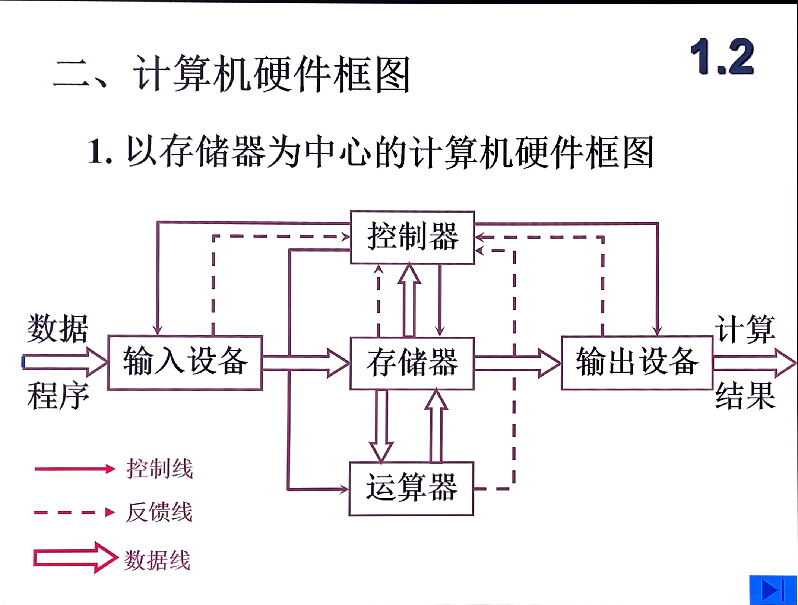
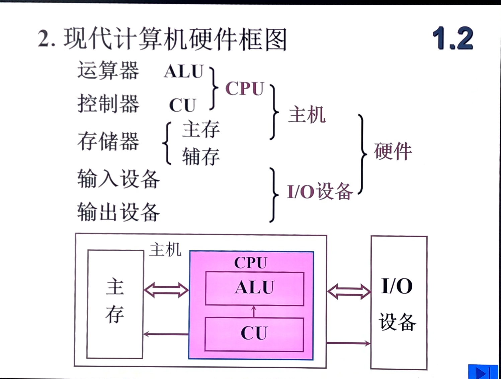
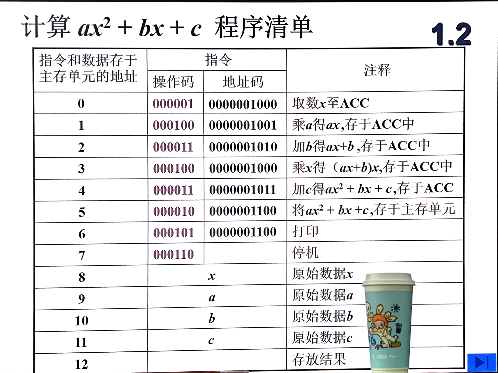
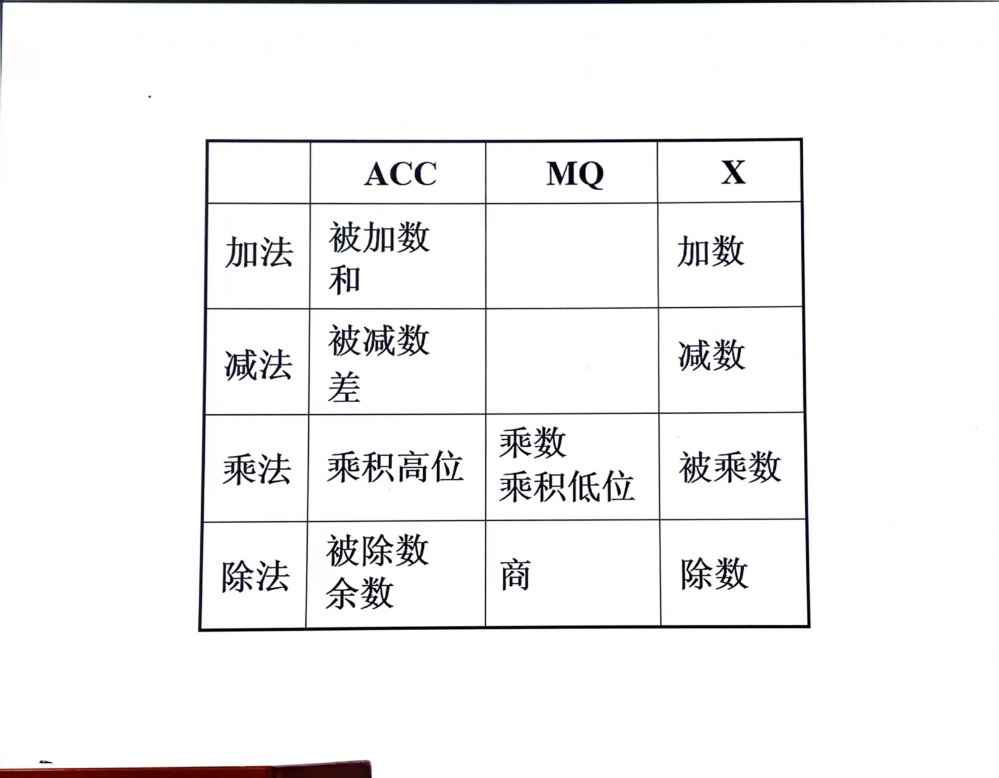
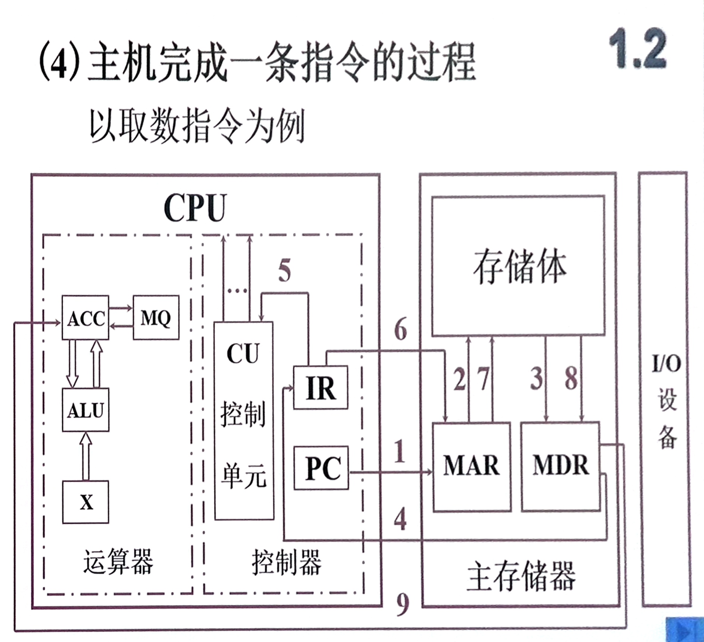

# 计算机组成原理期末复习（面向学习通版）

期末考试之前去看教学大纲要掌握的部分以及思维导图

## 第一篇 概论 计算机系统

**计算机系统**
- 硬件
	- 计算机的实体：主机、外设
- 软件
	- 由具有特殊功能的信息（程序）组成
	- 系统软件（管理整个计算机系统）
		- 语言处理系统
		- 编译器、解释器、汇编器
		- 操作系统
	- 应用软件（解决特定实际问题）
		- 功能
			- 办公软件
			- 网络通信
			- 多媒体
			- 行业软件
		- 按平台
			- 单机应用
			- 网络应用
			- 移动应用

**计算机系统层次结构**：
**硬件**
- 第零级：微指令系统（微程序机器M0）
- 第一级：执行机器语言（实际机器M1）
---
**软件**
- 第二级：汇编语言（虚拟机器M2）
- 第三级：高级语言（虚拟机器M3）
- 第四级：操作系统层（虚拟机器 M4）
- 第五级：应用语言层（虚拟机器 M5）

**计算机体系结构**
**计算机组成**
1. 冯诺依曼计算机特点
	1. 计算机五大部件
	2. 指令数据二进制表示
	3. 指令和数据是以同等地位存在，可以按地址访问
	4. 指令在存储器按顺序存放
	5. 指令有由操作码和地址码组成
	6. 以运算器为中心

**冯诺依曼计算机硬件框架**

**现代计算机硬件框架图**

**地址**
所有地址都在CPU存放

**存储器的基本组成**
存储体 -> 存储单元 ->  存储元件
大楼 -> 房间 -> 床位
每一个存储单元赋予一个地址号，按地址方位

**集成到CPU里的：**
**MAR**：存储器**地址**寄存器
- 位数决定了存储单元的个数
**MDR**：存储器**数据**寄存器
- 存放取出/存入的数据

**存储体**：
运算器的基本组成和操作
**运算器**
**ACC（累加器）、MQ（乘商寄存器）、X（操作数寄存器）**
**ACC**：存放操作数或运算结果。
**MQ**：专门用于存放乘法的乘积低位或除法的商。
 **X**：作为通用操作数寄存器，存放另一个操作数。

**控制器基本组成**
完成一条指令：取指令（PC）->  分析指令（IR）->  执行指令（CU）
PC：程序计数器，存放当前要执行的指令的地址，具有计数功能
IR：指令寄存器，存放当前欲执行的指令
CU：控制单元

| 缩写     | 中文名称       | 功能描述                        |
| :----- | :--------- | :-------------------------- |
| 1. ALU | ⑤ 算术逻辑单元   | a. 执行算术和逻辑运算                |
| 2. CU  | ② 控制单元     | b. 整个 CPU 的指挥控制中心           |
| 3. MAR | ③ 存储器地址寄存器 | g. 存放欲访问的存储单元的地址            |
| 4. PC  | ⑥ 程序计数器    | d. 存放当前欲执行指令的地址             |
| 5. IR  | ① 指令寄存器    | e. 存放当前欲执行的指令               |
| 6. MDR | ⑦ 存储器数据寄存器 | f. 存放取出 / 存入存储器的数据          |
| 7. ACC | ④ 累加器      | c. 存放算术或逻辑运算的一个操作数和运算结果的寄存器 |

### 1️⃣ 取指令阶段

1. **PC → MAR**：程序计数器（PC）将当前指令的地址送入存储器地址寄存器（MAR）。
2. **MAR → 存储体**：MAR 将地址发送到主存，主存根据地址找到对应的存储单元。
3. **存储体 → MDR**：主存将该地址中的指令取出，送入存储器数据寄存器（MDR）。
4. **MDR → IR**：MDR 将指令送入指令寄存器（IR），保存当前要执行的指令。
5. **PC + 1 → PC**：控制单元（CU）控制 PC 自动加 1，指向下一条指令的地址，为下一次取指做准备。

---

### 2️⃣ 分析与执行指令阶段

6. **IR → CU**：IR 将指令的操作码部分送入控制单元（CU），CU 对指令进行译码，产生相应的控制信号。
7. **IR → MAR**：IR 将指令中包含的操作数地址送入 MAR，准备读取数据。
8. **存储体 → MDR**：主存根据 MAR 中的地址，将操作数取出并送入 MDR。
9. **MDR → ACC**：MDR 将取出的操作数送入累加器（ACC），完成 “取数” 操作。

---
**作为常考题，各种指令的执行过程**

硬件主要技术指标
1. 机器字长：CPU一次能处理数据的位数与CPU中的寄存器位数有关
2. 运算速度
	1. 主频：主频是指 CPU 内部时钟脉冲的频率
	2. 吉普森法
	3. MIPS：每秒钟执行百万条指令
	4. CPI：执行一条指令所需的时钟周期
	5. FLOPS：每秒浮点运算次数
3. 存储容量
	1. 主存容量
		1. 存储单元个数 * 储存字长
		2. 字节数
	2. 辅助容量
		1. 字节数 80GB

**第1次课后作业**

- 1、什么是计算机系统？说明计算机系统的层次结构。

- 2、画出计算机硬件基本组成框图，通过解题过程说明每一功能部件的作用及它们之间的信息流向。

- 3、解释英文缩写的含义：CPU、PC、IR、CU、ALU、ACC、MQ、X、MAR、MDR、MM、I/O

- 4、自学第2章 计算机的发展及应用
----
# 计算机系统 概论

## 1. 计算机系统的组成

一台计算机从功能上看包括 5 个基本子系统：输入、输出、存储、控制、算术逻辑运算。

| 部件/系统 | 作用              | 常考点          |
| ----- | --------------- | ------------ |
| 运算器   | 完成算术运算和逻辑运算     | 核心部件是 ALU    |
| 控制器   | 取指令、分析指令、发出控制信号 | 不负责数据运算结果的存储 |
| 存储器   | 存放程序和数据         | 分为主存和辅存      |
| 输入设备  | 向计算机输入信息        | 如键盘、鼠标       |
| 输出设备  | 输出处理结果          | 如显示器、打印机     |

完整的计算机系统包括**硬件系统和软件系统**
题目中“一台计算机包括输入、输出、控制、存储及算术逻辑运算 5 个子系统”是正确说法。

## 2. CPU、主机、外部设备

| 概念      | 组成                    |
| ------- | --------------------- |
| CPU     | 运算器 + 控制器             |
| 主机      | 运算器 + 控制器 + 主存储器      |
| 外部设备    | 输入设备 + 输出设备 + 外接辅助存储器 |
| 完整计算机系统 | 硬件设备 + 软件设备           |

重点：
电子计算机的算术/逻辑单元、控制单元及主存储器合称为**主机**
输入、输出装置以及外接的辅助存储器称为**外部设备**。

## 3. ALU、控制器和常见寄存器

ALU 是算术逻辑单元，能完成算术运算和逻辑运算。它不是只做加法，也不是只做算术运算，一般也不说 ALU 负责长期存放运算结果，所以题目中关于 ALU 的几个选项“只做算术”“只做加法”“能存放运算结果”都不严谨。

| 名称       | 作用            |
| -------- | ------------- |
| ALU      | 完成算术运算和逻辑运算   |
| 控制器      | 解释指令并发出控制信号   |
| 程序计数器 PC | 存放下一条待执行指令的地址 |
| 指令寄存器 IR | 存放当前正在执行的指令   |
| 累加器 ACC  | 暂存运算数据或运算结果   |

重点：用来指定待执行指令所在**地址**的是**程序计数器 PC**。

## 4. 存储系统与存储单位

计算机系统中的存储系统通常指**主存和辅存**。主存可被 CPU 直接访问，速度较快；辅存容量大、可长期保存信息，但速度较慢。

| 单位        | 含义                  |
| --------- | ------------------- |
| bit / 比特  | 信息表示的最小单位，取值 0 或 1  |
| Byte / 字节 | 常用存储容量单位，1B = 8bit  |
| KB        | 1KB = 2^10B = 1024B |
| MB        | 1MB = 2^20B         |
| GB        | 1GB = 2^30B         |

注意：本题集中“计算机存储数据的基本单位”按老师答案选**比特**，因为 bit 是信息存储和表示的最小单位；但平时说存储器容量时，常用单位是字节 Byte。

例：容量为 640K 的存储器，通常指 `640 × 2^10` 字节的存储器。

## 5. 冯·诺依曼机基本思想

冯·诺依曼计算机的核心思想是**存储程序**，即程序和数据一样存放在存储器中，由计算机自动取出并执行。

| 特点    | 说明                      |
| ----- | ----------------------- |
| 存储程序  | 程序和数据都存放在存储器中           |
| 程序控制  | 按程序规定自动执行               |
| 按地址访问 | 存储器按地址访问                |
| 顺序执行  | 一般按指令地址顺序执行，遇到转移指令可改变顺序 |

重点：冯·诺依曼机工作方式的基本特点是**按地址访问并顺序执行指令**。

计算机和袖珍计算器的本质区别不在速度、容量或规模，而在**自动化程度的高低**，也就是计算机能按存储的程序自动工作。

## 6. 软件系统

软件通常分为系统软件和应用软件。

| 类型   | 例子                  | 作用             |
| ---- | ------------------- | -------------- |
| 系统软件 | 操作系统、编译程序、连接程序、装入程序 | 管理计算机资源，支持程序运行 |
| 应用软件 | 文本处理程序、表格软件、浏览器等    | 面向具体应用任务       |

重点：文本处理程序属于**应用软件**；操作系统、编译程序、连接程序一般属于系统软件。

计算机只能直接识别和执行**机器语言**，人类常用高级语言编写程序，所以人机之间需要借助**编译程序**等翻译软件，把高级语言程序翻译成机器语言程序。

## 7. 性能指标和地址空间

评估计算机执行速度时，可以用**每秒执行的指令数**作为依据，如 MIPS 等指标。题目中“评估计算机的执行速度可以用每秒执行的指令数为判断依据”是正确说法。

**地址空间大小由地址位数决定：若地址有 n 位，则地址空间为 `2^n` 个。

例：一般 8 位微型机系统若用 16 位表示地址，则地址空间为 `2^16 = 65536` 个。注意，8 位微型机的“8 位”通常指一次处理的数据宽度，不代表地址空间只有 2^8。

## 8. 高频考点汇总

1. 计算机功能上包括输入、输出、存储、控制、算术逻辑运算 5 个子系统。
2. CPU = 运算器 + 控制器。
3. 主机 = 运算器 + 控制器 + 主存储器。
4. 外部设备 = 输入设备 + 输出设备 + 外接辅助存储器。
5. 完整计算机系统 = 硬件系统 + 软件系统。
6. 存储系统通常指主存和辅存。
7. ALU 完成算术运算和逻辑运算，不是只做加法。
8. 程序计数器 PC 存放下一条待执行指令的地址。
9. 冯·诺依曼机基本特点是按地址访问并顺序执行指令。
10. 计算机与袖珍计算器的本质区别是自动化程度不同。
11. 文本处理程序属于应用软件。
12. 操作系统、编译程序、连接程序属于系统软件。
13. 高级语言程序需要通过编译程序等翻译成机器语言程序。
14. 存储数据的最小单位是 bit，比特。
15. 1B = 8bit，1KB = 2^10B。
16. 640K 存储器通常指 `640 × 2^10` 字节。
17. 地址位数为 n，则地址空间为 `2^n`。
18. 16 位地址对应 65536 个地址空间。

## 9. 易错点

- 控制器不是“理解、解释并执行所有指令及存储结果”，控制器主要负责控制和协调，运算由运算器完成。
- 所有数据运算不是在控制器中完成，而是在运算器/ALU 中完成。
- ALU 不是只做算术运算，也不是只做加法。
- 主机不是只有 CPU，主机包括 CPU 和主存。
- 外部设备包括输入、输出设备，也包括外接辅助存储器。
- 完整计算机系统不仅有硬件，还必须有软件。
- 存储系统不是只指 RAM 或 ROM，而是主存和辅存。
- “基本存储单位”本题按 bit 选；“容量单位”常用 Byte。
- 8 位微型机不代表地址空间只有 256，若地址用 16 位表示，则地址空间是 65536。
- 数据库本身不简单等同于系统软件；文本处理程序属于应用软件。
- 磁盘驱动器既可能涉及输入，也可能涉及输出，不是只有输入功能。

----
# 总线章节复习笔记

## 1. 总线概念与分类

总线是连接多个部件的信息传输线，是各部件共享的传输介质。

| 分类方式 | 类型   | 含义/连接对象             | 高频考点             |
| ---- | ---- | ------------------- | ---------------- |
| 按位置分 | 片内总线 | CPU 内部各部件之间         | 关键词：CPU 内部       |
|      | 系统总线 | CPU、主存、I/O 设备之间     | 三大部件之间           |
|      | 通信总线 | 计算机系统之间，或计算机与其他系统之间 | 系统之间             |
| 按内容分 | 数据总线 | 传送数据                | 属于系统总线           |
|      | 地址总线 | 传送地址信息              | 选择存储单元和 I/O 接口地址 |
|      | 控制总线 | 传送控制信号和状态信号         | 控制读写、响应等         |

重点记：CPU、主存、I/O 设备之间是**系统总线**；计算机与计算机之间是**通信总线**；数据线、地址线、控制线是按**总线传输的内容**划分的。地址线不仅选择存储器单元，也选择 I/O 设备接口地址。

## 2. 总线结构的优缺点

总线结构的优点：便于增减外设，便于模块化/积木化设计，减少信息传输线的条数，结构简单、扩展方便。

总线结构的缺点：总线是共享传输介质，同一时刻不能有多个信息源同时传送信息。
注意，正确说法是**两种信息源的代码在总线中不能同时传送**，不是“地址、数据、控制信息不能同时出现”。

## 3. 主设备、从设备与总线仲裁

| 概念    | 含义                    | 常考表述           |
| ----- | --------------------- | -------------- |
| 总线主设备 | 获得总线控制权的设备            | 能主动发起总线操作      |
| 总线从设备 | 被主设备访问，只能响应主设备命令的设备   | 只能响应，不能主动控制总线  |
| 总线仲裁  | 多个主设备申请总线时，由总线控制器进行判优 | 解决多个主设备争用总线的问题 |

重点记：获得总线控制权的是**总线主设备**；被主设备访问、只能响应命令的是**总线从设备**；总线仲裁又叫总线判优。

## 4. 集中式总线控制方式

集中式总线控制主要有三种：链式查询、计数器定时查询、独立请求。

| 方式      | 特点              | 高频考点               |
| ------- | --------------- | ------------------ |
| 链式查询    | 结构简单，请求线少，优先级固定 | 只有一条总线请求线；对电路故障最敏感 |
| 计数器定时查询 | 通过计数器依次查询设备     | 优先级取决于计数起点         |
| 独立请求    | 每个设备有独立请求线和响应线  | 响应最快；代价是控制线多       |

计数器定时查询要记住：如果每次从 0 开始计数，则**设备号小的优先级高**；如果每次从上一次终止点开始计数，则**每个设备使用总线的机会相等**。

独立请求方式要记住：响应时间最快，但控制线最多；若有 N 个设备，则有 **N 个总线请求信号和 N 个总线响应信号**。

链式查询方式要记住：若有 N 个设备，也只有**一条总线请求线**，并且对电路故障最敏感。

## 5. 三总线结构与 PCI 总线

三总线结构指：**I/O 总线、主存总线、DMA 总线**。

| 易混概念      | 内容                 |
| --------- | ------------------ |
| 三总线结构     | I/O 总线、主存总线、DMA 总线 |
| 系统总线按内容分类 | 数据总线、地址总线、控制总线     |

PCI 总线是与处理器时钟频率无关的高速外部总线。重点记：PCI 是高速外部总线，与 CPU 时钟频率无关，支持自动配置，兼容性较好，系统中可以有多条 PCI 总线。

## 6. 总线通信控制

总线通信控制主要解决通信双方如何协调传输。

| 通信方式 | 含义/特点          | 高频考点          |
| ---- | -------------- | ------------- |
| 同步通信 | 由统一时序控制，有统一时钟  | 同步控制 = 统一时序控制 |
| 异步通信 | 没有统一时钟，靠应答信号协调 | 不互锁速度最快       |

异步通信方式速度比较：**不互锁最快，半互锁次之，全互锁最慢但更可靠**。

## 7. 总线带宽计算

总线带宽 = 每个总线周期传送的数据量 × 总线频率。若一个总线周期等于一个时钟周期，则总线带宽 = 每个时钟周期传送的数据量 × 时钟频率。

例题：一个总线周期可并行传送 8 个字节，一个总线周期等于一个时钟周期，时钟频率为 66MHz，则总线带宽 = 8B × 66MHz = **528MB/s**，答案为 **528 MBps**。

注意：8 个字节是 8B，不是 8bit；MHz 表示每秒百万次；题目中 MBps 一般按 10^6 B/s 计算。

## 8. 高频考点汇总

1. 总线是多个部件共享的信息传输线。
2. 系统总线连接 CPU、主存和 I/O 设备。
3. 通信总线连接计算机系统之间，或计算机与其他系统之间。
4. 系统总线按**内容**分为数据总线、地址总线、控制总线。
5. 地址线用于选择存储器单元和 I/O 接口地址。
6. 总线结构优点是便于扩展、减少传输线条数。
7. 总线结构缺点是多个信息源不能同时占用总线。
8. 总线主设备是获得总线控制权的设备。
9. 总线从设备只能响应主设备命令。
10. 总线仲裁解决多个主设备争用总线的问题。
11. 链式查询只有一条总线请求线，对电路故障最敏感。
12. 独立请求方式响应最快，代价是控制线多。
13. 计数器从 0 开始，设备号小的优先级高。
14. 计数器从上次终止点开始，各设备机会相等。
15. 三总线结构是 I/O 总线、主存总线、DMA 总线。
16. PCI 总线是与处理器时钟频率无关的高速外部总线。
17. 同步控制是由统一时序控制。
18. 异步通信中不互锁速度最快。
19. 总线带宽 = 每周期传送数据量 × 总线频率。

## 9. 易错点

- 总线结构缺点：不是“地址、数据、控制不能同时出现”，而是**两种信息源不能同时传送**。
- 三总线结构：是**I/O 总线、主存总线、DMA 总线**，不是数据线、地址线、控制线。
- 系统总线和通信总线：三大部件之间是系统总线，系统之间是通信总线。
- 计数器定时查询：从 0 开始是设备号小优先，从上次终止点开始是机会均等。
- 独立请求方式：响应最快，但不是控制线少，而是控制线最多。
- 带宽计算：一定看清单位是“字节 B”还是“位 bit”。

----
# 存储器章节复习笔记（习题课1）

## 1. 存储器基础概念

存储器用于存放程序和数据，是计算机的重要组成部分。按在系统中的作用，一般分为主存、辅存和高速缓存。

| 类型         | 特点                         | 常见例子      |
| ---------- | -------------------------- | --------- |
| 高速缓存 Cache | 容量小，速度最快，成本最高              | CPU Cache |
| 主存         | 可被 CPU 直接访问，速度较快，容量较小，成本较高 | RAM、ROM   |
| 辅存         | 容量大，速度慢，成本低，断电后可长期保存       | 磁盘、U盘、光盘  |

主存和辅存相比：**主存容量小、速度快、成本高**。辅存的特点一般是容量大、速度慢、成本低、可长期保存。

## 2. RAM、ROM 与常见存储芯片

RAM 是随机存取存储器，通常可读可写，断电后信息一般丢失。ROM 是只读存储器，断电后信息仍能保存。

| 类型     | 特点                       |
| ------ | ------------------------ |
| RAM    | 可读可写，通常易失                |
| ROM    | 只读或主要读，非易失               |
| PROM   | 可编程 ROM，但通常只能写入一次，不一定可改写 |
| EPROM  | 可擦除可编程 ROM，通常用紫外线擦除      |
| EEPROM | 电可擦除可编程 ROM              |
| Flash  | 闪存，属于可电擦写的非易失存储器         |

重点：**可编程的只读存储芯片不一定是可改写的**，例如 PROM 可编程但一般不能反复改写。

## 3. SRAM、DRAM、磁盘与刷新

| 存储介质 | 是否需要刷新  | 说明                |
| ---- | ------- | ----------------- |
| SRAM | 不需要刷新   | 速度快，成本高，常用于 Cache |
| DRAM | 需要刷新    | 集成度高，成本低，常用于主存    |
| 磁盘   | 不需要定时刷新 | 信息可长期保存           |

注意：需要定时刷新的通常是 **DRAM**，不是磁盘。磁盘上的信息不需要定时刷新，否则题目说“磁盘上的信息必须定时刷新，否则无法长期保存”是错误的。

## 4. 半导体存储芯片材料特点

半导体存储芯片常见有双极性半导体存储芯片和 MOS（金属氧化物半导体）存储芯片。

| 类型 | 特点 |
|---|---|
| 双极性半导体存储芯片 | 速度快，但价格贵，功耗较大 |
| MOS 存储芯片 | 集成度高，成本较低，应用更广 |

重点：**双极性半导体存储芯片通常比 MOS 存储芯片存取速度快，但价格也贵。**

## 5. 存取时间、存取周期

| 概念   | 含义                       |
| ---- | ------------------------ |
| 存取时间 | 从启动一次存取操作到完成该操作所需的时间     |
| 存取周期 | 存储器进行连续两次读/写操作所允许的最短时间间隔 |

重点：**存取周期不是单纯的读出时间或写入时间，而是连续读或写操作允许的最短间隔时间。**

## 6. 主存容量受什么限制

大多数个人计算机中，可配置的最大主存容量主要受**地址总线位数**限制，而不是受指令中地址码位数限制。

规律：若地址总线有 n 位，则最多可形成 `2^n` 个地址空间。

例：16 位地址可表示 `2^16 = 65536` 个地址空间。

## 7. 字长、存储容量与寻址范围

计算这类题时，先看是按字节编址还是按字编址。本题集中都是**按字编址**。

核心公式：`按字编址的寻址范围 = 存储容量 / 每个字的字节数`

| 字长 | 每个字占多少字节 |
|---|---|
| 8 位 | 1B |
| 16 位 | 2B |
| 32 位 | 4B |
| 64 位 | 8B |

常见换算：`1KB = 1024B`，`1MB = 1024KB`，`1K = 1024`。

题集例题整理：

| 字长   |  存储容量 | 按字编址计算     | 寻址范围 |
| ---- | ----: | ---------- | ---: |
| 32 位 | 256KB | 256KB / 4B |  64K |
| 32 位 |  64KB | 64KB / 4B  |  16K |
| 16 位 |  64KB | 64KB / 2B  |  32K |
| 16 位 |   1MB | 1MB / 2B   | 512K |

注意：按字编址求出来的是“有多少个字地址”，所以答案通常写 **K**，不是 KB。比如 256KB、32 位、按字编址，答案是 **64K**，不是 64KB。

## 8. 存储芯片容量表示法

存储芯片常写成 `M × N 位`，意思是：有 M 个存储单元，每个单元 N 位。

| 表示          | 含义                 |
| ----------- | ------------------ |
| 512 × 8 位   | 512 个单元，每个单元 8 位   |
| 32K × 8 位   | 32K 个单元，每个单元 8 位   |
| 128K × 16 位 | 128K 个单元，每个单元 16 位 |
| 16K × 32 位  | 16K 个单元，每个单元 32 位  |
 
地址线数量由“有多少个单元”决定；数据线数量由“每个单元多少位”决定。

公式：`地址线数 = log2(存储单元个数)`，`数据线数 = 每个单元的位数`

例：`16K × 32 位` 中，16K = 2^14，所以地址线 14 根；每个单元 32 位，所以数据线 32 根；地址线和数据线总和为 `14 + 32 = 46`。

## 9. RAM 芯片引出线最少数目

题目问“除电源和接地端外，该芯片引出线的最少数目”，一般计算：`引出线数 = 地址线 + 数据线 + 控制线`。

在这类题中，RAM 控制线通常按 2 根算：片选 CS、读写控制 WE/OE 等。

题集例题整理：

| RAM 容量      | 地址线 | 数据线 | 控制线 | 最少引出线 |
| ----------- | --: | --: | --: | ----: |
| 512 × 8 位   |   9 |   8 |   2 |    19 |
| 32K × 8 位   |  15 |   8 |   2 |    25 |
| 128K × 16 位 |  17 |  16 |   2 |    35 |

计算方法：512 = 2^9，所以地址线 9 根；32K = 2^15，所以地址线 15 根；128K = 2^17，所以地址线 17 根。

## 10. 地址空间计算

地址空间个数由地址位数决定：`地址空间 = 2^地址位数`。

例：一般 8 位微型机系统用 16 位表示地址，则地址空间为 `2^16 = 65536` 个。
 
注意：8 位微型机的“8 位”通常指数据字长或数据处理宽度，不代表地址空间只有 2^8。题目给 16 位地址，就按 16 位算地址空间。

## 11. 高频考点汇总

1. 主存相对辅存：容量小、速度快、成本高。
2. 辅存相对主存：容量大、速度慢、成本低，可长期保存。
3. 可编程 ROM 不一定可改写，PROM 通常只能写入一次。
4. DRAM 需要刷新，磁盘不需要定时刷新。
5. 双极性半导体存储芯片速度快，但价格贵。
6. 大多数个人计算机最大主存容量主要受地址总线位数限制。
7. 存取周期是连续两次读/写操作允许的最短时间间隔。
8. 地址线位数 n 决定地址空间大小为 2^n。
9. 按字编址时，寻址范围 = 存储容量 / 字长字节数。
10. 32 位字长 = 4B，16 位字长 = 2B。
11. `M × N 位` 中，M 决定地址线，N 决定数据线。
12. 地址线数 = log2(存储单元个数)。
13. 数据线数 = 每个存储单元的位数。
14. RAM 芯片最少引出线 = 地址线 + 数据线 + 控制线。
15. 16 位地址对应 65536 个地址空间。

## 12. 易错点

- “可编程 ROM”不等于“一定可改写”，PROM 可以编程但通常不能反复改写。
- 最大主存容量主要受地址总线位数限制，不是受指令中地址码位数限制。
- 磁盘信息不需要定时刷新，需要刷新的主要是 DRAM。
- 存取周期不是读出时间，也不是写入时间，而是连续读/写操作的最短间隔。
- 按字编址求寻址范围时，要用总字节数除以每个字占的字节数。
- 寻址范围的答案通常写 K、M，不要随便写成 KB、MB。
- `16K × 32 位` 的 16K 决定地址线，32 位决定数据线。
- 8 位微型机不代表地址只有 8 位，题目说 16 位地址就有 65536 个地址空间。
- RAM 芯片引出线题不要漏掉控制线。

---
# 输入输出系统复习笔记（习题课1）

## 1. I/O 系统基础

输入输出系统负责主机与外部设备之间的信息交换。外设速度通常比 CPU 和主存慢很多，所以 I/O 系统的核心问题是：如何让主机和外设协调工作，提高数据传送效率。

常见 I/O 设备包括键盘、鼠标、显示器、打印机、磁盘、网络设备等。外设不能直接和 CPU 内部寄存器随意交换数据，通常需要通过 I/O 接口进行连接和控制。

I/O 接口的基本作用：实现主机和外设之间的数据缓冲、速度匹配、格式转换、状态检测和控制命令传送。

## 2. 串行传输与并行传输

| 方式   | 特点             | 适用场景     |
| ---- | -------------- | -------- |
| 串行传输 | 数据在一条线路上按位依次传送 | 远距离传输    |
| 并行传输 | 多位数据通过多条线路同时传送 | 近距离、高速传输 |

串行传输的特点：线路成本低，适合远距离传输，但通常传输速度不如并行传输快。题目中“不属于串行传输特点”的是**传输速度快**。

主机和终端串行传送数据时，常需要进行串—并或并—串转换。这种转换可以用软件实现，并非一定要用专门硬件实现。

## 3. 总线结构与外设扩展

计算机使用总线结构，便于增减外设，同时可以减少信息传输线的条数。

重点：总线结构的优点不是减少信息传输量，也不是一定提高传输速度，而是**减少传输线条数、便于扩展外设**。

## 4. I/O 编址方式

I/O 编址主要有统一编址和独立编址两种。

| 编址方式 | 特点                 | 是否需要专门 I/O 指令 |
| ---- | ------------------ | ------------- |
| 统一编址 | 外设接口和主存统一使用同一个地址空间 | 不需要           |
| 独立编址 | I/O 地址空间和主存地址空间分开  | 需要            |

统一编址中，外部设备和主存储器共用 CPU 的整个访问存储空间，所以可以像访问存储器一样访问 I/O 端口，无需单独的 I/O 指令。

重点：题目说“外部设备和主存储器共用 CPU 的整个访问存储空间，无需单独的 I/O 指令”，选**统一编址**。

## 5. 主机与外设的数据传送方式

主机与外设之间常见的数据传送方式有：程序查询方式、中断方式、DMA 方式、通道方式。

| 方式     | 基本特点                   | CPU 参与程度 |
| ------ | ---------------------- | -------- |
| 程序查询方式 | CPU 不断查询设备状态，设备准备好后才传送 | 最高       |
| 中断方式   | 设备准备好后主动向 CPU 发中断请求    | 较高       |
| DMA 方式 | 外设和主存之间直接传送数据          | 较低       |
| 通道方式   | 由专门通道控制 I/O 操作         | 更低       |

程序查询方式下，CPU 和外设是串行工作的。CPU 必须不断等待和查询设备状态，除非计算机等待，否则无法传送数据给计算机。因此程序查询方式效率较低，适合简单、低速设备。

重点：题目说“除非计算机等待，否则无法传送数据给计算机”，选**程序查询方式**。题目说“主机与设备是串行工作的”，也选**程序查询方式**。

## 6. 中断方式

中断方式是指外设或异常事件向 CPU 发出中断请求，CPU 暂停当前程序，转去执行中断服务程序，处理完后再返回原程序继续执行。

中断方式的优点：CPU 不必一直等待外设，可以提高 CPU 利用率。

常见会提出中断请求的情况：键盘输入过程中，每按一次键都可能产生一次中断请求。两数相加或相减结果为零，一般只是影响标志位，不一定提出中断请求。

## 7. 中断响应过程中的硬件自动操作

中断发生时，有些操作由硬件自动完成，不是靠普通指令完成。

| 操作 | 完成方式 |
|---|---|
| 程序计数器 PC 内容的保护和更新 | 硬件自动完成 |
| 中断响应周期中，允许中断触发器置 0 | 硬件自动完成 |

重点：中断发生时，PC 内容需要保护现场并更新为中断服务程序相关地址，这属于**硬件自动**完成。中断响应周期中，允许中断触发器置 0 也是**硬件自动**完成。

## 8. 中断向量与中断向量地址

| 概念         | 含义              |
| ---------- | --------------- |
| 中断服务程序入口地址 | 中断服务程序开始执行的位置   |
| 中断向量       | 通常存放中断服务程序入口地址  |
| 中断向量地址     | 存放中断服务程序入口地址的地址 |

重点：中断向量地址不是中断服务程序入口地址本身，而是**中断服务程序入口地址的地址**。

题目问“中断向量地址是”，选**中断服务程序入口地址的地址**。

## 9. DMA 方式

DMA 是直接存储器存取方式，用于外设和主存之间直接传送数据。DMA 传送时，数据不需要经过 CPU 内部寄存器逐个搬运，因此适合高速外设和大批量数据传送。

DMA 的特点：CPU 只在传送前进行初始化，传送过程中由 DMA 控制器接管总线，传送结束后可向 CPU 发中断通知。

DMA 不能完全取代中断方式。因为 DMA 主要负责数据块传送，而传送开始、结束、异常处理等仍可能需要中断方式配合。

重点：DMA 方式**不能取代中断方式**，也可以在传送结束后向 CPU 请求中断。

## 10. DMA 的周期窃取/周期挪用

DMA 常用周期窃取方式，也叫周期挪用方式。

周期窃取是指 DMA 控制器在需要访问主存时，暂时占用一个存储器存取周期，使 CPU 暂停访问主存一个周期，完成一次 DMA 数据传送。

| 概念 | 含义 |
|---|---|
| 周期挪用 | 常用于 DMA 输入输出 |
| 周期窃取 | DMA 窃取一个存取周期 |

重点：周期挪用方式常用于**DMA 方式的输入输出**；DMA 中周期窃取窃取的是一个**存取周期**，不是指令周期、CPU 周期或总线周期。

> **存储器存取周期**，也就是主存完成一次读/写的时间。
## 11. 四种 I/O 方式对比

| I/O 方式 | 数据传送特点       | CPU 是否等待 | 适用情况          |
| ------ | ------------ | -------- | ------------- |
| 程序查询方式 | CPU 主动查询设备状态 | 经常等待     | 简单低速设备        |
| 中断方式   | 设备准备好后通知 CPU | 不必一直等待   | 随机、低速或中速 I/O  |
| DMA 方式 | 主存和外设直接传送    | CPU 参与少  | 高速、大批量数据      |
| 通道方式   | 通道控制 I/O 操作  | CPU 参与更少 | 大型机或复杂 I/O 系统 |

重点区分：程序查询方式下主机和设备是串行工作的；中断方式减少 CPU 等待；DMA 方式适合高速外设，但不能取代中断；通道方式比 DMA 更进一步，能承担更多 I/O 控制工作。

## 12. 高频考点汇总

1. 串行传输是数据在一条线路上按位依次传输。
2. 串行传输线路成本低，适合远距离传输，但通常不是速度快。
3. 串—并或并—串转换可以用软件实现，不一定必须用硬件。
4. 总线结构便于增减外设，同时减少信息传输线条数。
5. 统一编址中，外设和主存共用地址空间，无需单独 I/O 指令。
6. 程序查询方式下，CPU 需要等待设备，主机和设备是串行工作的。
7. 中断方式下，设备准备好后向 CPU 发出中断请求。
8. 键盘每按一次键可能产生一次中断请求。
9. 中断发生时，程序计数器 PC 的保护和更新由硬件自动完成。
10. 中断响应周期中，允许中断触发器置 0 由硬件自动完成。
11. 中断向量地址是中断服务程序入口地址的地址。
12. DMA 是直接存储器存取方式，适合高速、大批量数据传送。
13. 周期挪用方式常用于 DMA 输入输出。
14. DMA 周期窃取窃取的是一个存取周期。
15. DMA 不能取代中断方式，DMA 结束或异常时仍可能需要中断。

## 13. 易错点

- 串行传输不是“传输速度快”，它的典型特点是线路少、成本低、适合远距离。
- 串—并或并—串转换不一定必须用专门硬件，也可以用软件实现。
- 程序查询方式效率低，因为 CPU 需要不断等待和查询设备。
- 统一编址不需要单独 I/O 指令，独立编址才需要专门 I/O 指令。
- 中断向量地址不是入口地址本身，而是存放入口地址的地址。
- 中断响应中的 PC 保护和更新是硬件自动完成，不是堆栈指令、访存指令或 I/O 指令完成。
- 周期窃取不是窃取指令周期，而是窃取一个存取周期。
- DMA 适合高速传输，但不能完全代替中断方式。
- 两数运算结果为零一般只影响标志位，不是典型中断请求来源。

---
# 计算机的运算方法复习笔记

## 1. 数制转换与大小比较

常见进制：二进制、八进制、十进制、十六进制。二进制每 3 位对应 1 位八进制，每 4 位对应 1 位十六进制。

| 进制   | 例子          | 转换要点            |
| ---- | ----------- | --------------- |
| 二进制  | `(101001)2` | 按 2 的权展开        |
| 八进制  | `(52)8`     | 一位八进制对应 3 位二进制  |
| 十六进制 | `(2B)16`    | 一位十六进制对应 4 位二进制 |
| 十进制  | `(44)10`    | 日常数字            |

比较不同进制数大小时，统一转成十进制最稳。例：`(101001)2 = 41`，`(52)8 = 42`，`(2B)16 = 43`，`(44)10 = 44`，所以最小的是 `(101001)2`。再例：`(10010101)2 = 149`，`(227)8 = 151`，`(96)16 = 150`，`(149)10 = 149`，所以最大的是 `(227)8`。

十进制转十六进制：56 ÷ 16 = 3 余 8，所以 `56 = 38H`。注意不要把十进制 56 直接写成十六进制 56。

## 2. 原码、反码、补码、移码

机器数是计算机中带符号数的表示形式，常见有原码、反码、补码、移码。一般最高位为符号位，0 表示正，1 表示负。

| 表示方法 | 正数表示            | 负数表示            | 0 的表示     |
| ---- | --------------- | --------------- | --------- |
| 原码   | 符号位 0，数值位为真值绝对值 | 符号位 1，数值位为真值绝对值 | 有 +0 和 -0 |
| 反码   | 与原码相同           | 符号位不变，数值位按位取反   | 有 +0 和 -0 |
| 补码   | 与原码相同           | 反码末位加 1         | 0 唯一      |
| 移码   | 真值加偏置值，常用于阶码    | 与补码符号位相反、数值位相同  | 0 唯一      |

重点：真值 0 表示形式唯一的是**补码和移码**；原码和反码都有 +0 和 -0。

## 3. 定点整数和定点小数的表示范围

定点整数中，原码、反码、补码都能表示 -1，但它们的表示范围不完全相同。定点小数中，原码和反码不能表示 -1，补码可以表示 -1，所以小数定点机中**只有补码能表示 -1**。

| 情况 | 结论 |
|---|---|
| 整数定点机 | 原码、反码、补码均可表示 -1 |
| 小数定点机 | 只有补码能表示 -1 |
| `[x]补 = 1.000...0` | 在定点小数中表示 -1 |
| 真值 0 | 补码和移码表示唯一 |

若机器字长为 8 位，采用补码，且含 1 位符号位，则表示范围是 `-128 ~ 127`。一般 n 位补码整数范围是 `-2^(n-1) ~ 2^(n-1)-1`。

若用 `n+1` 位表示定点数，其中 1 位为符号位、n 位为数值位，则整数的绝对值范围为 `0 ≤ |N| ≤ 2^n - 1`，小数的绝对值范围为 `0 ≤ |N| ≤ 1 - 2^-n`。

## 4. 补码转换与位数判断

负数补码的求法：先写出对应正数的二进制，再按位取反，最后加 1。求 `[-X]补` 时，也可以直接对 `[X]补` 取反加 1。

| 真值 | 8 位补码 | 十六进制 |
|---|---|---|
| -27 | 1110 0101 | E5H |
| -39 | 1101 1001 | D9H |
| 56 | 0011 1000 | 38H |

例：-27 的 8 位补码：27 = `0001 1011`，取反得 `1110 0100`，加 1 得 `1110 0101`，即 `E5H`。例：-39 的 8 位补码：39 = `0010 0111`，取反得 `1101 1000`，加 1 得 `1101 1001`，即 `D9H`。

判断补码至少需要多少位：用补码范围 `-2^(n-1) ~ 2^(n-1)-1`。例：`x = -8192 = -2^13`，要能表示 -8192，需要 `-2^(n-1) ≤ -8192`，所以 `n-1 ≥ 13`，至少需要 **14 位**。

## 5. 补数、求负和移码

在模为 M 的系统中，`-x` 的补数为 `M - x`。例：模为 16，-7 的补数是 `16 - 7 = 9`。

已知 `[X]补 = 1011 0001`，求 `[-X]补`：取反得 `0100 1110`，加 1 得 `0100 1111`。若 `X = -26`，则 `-X = 26`，所以 8 位下 `[-X]补 = 0001 1010`。

移码常用于浮点数阶码。同一数值的移码和补码一般可以记为：**符号位相反，数值位相同**。例：`X = -10101`，用 6 位表示时，补码为 `101011`，移码为 `001011`。

## 6. 补码加减运算和溢出判断

补码加减法中，符号位一起参加运算，最高位进位通常丢弃。减法可以转化为加法：`X - Y = X + (-Y)`。

例：`X = 0.1011`，`Y = -0.0101`，则 `X + Y = 0.1011 - 0.0101 = 0.0110`，所以 `[X+Y]补 = 0.0110`。例：机器字长 8 位，`X = 15`，`Y = 24`，则 `X - Y = -9`，9 的二进制是 `0000 1001`，取反加 1 得 `1111 0111`，所以 `[X-Y]补 = 1111 0111`。

补码溢出常见判断方法：
>简单来说，就是判断计算的结果又没有超出n位二进制能够表示的范围，超过了就是溢出

下面这个表格就是在溢出时的一些特征

| 方法    | 判断规则                  |
| ----- | --------------------- |
| 符号判断法 | 两个同号数相加，结果变号，则溢出      |
| 进位判断法 | 最高有效数值位进位与符号位进位不同，则溢出 |
| 变形补码法 | 结果两个符号位不同，则溢出         |

易错点：变形补码中，两个符号位**不同**才是溢出，两个符号位相同不是溢出。

## 7. 逻辑移位和算术移位

**逻辑移位**把数当作无符号数处理，空位补 0。**算术移位**把数当作有符号数处理，右移时要保持符号位。

| 移位方式 | 左移             | 右移     |
| ---- | -------------- | ------ |
| 逻辑移位 | 低位补 0          | 高位补 0  |
| 算术移位 | 低位补 0，符号位按规则保留 | 高位补符号位 |

例：`1011 0011` 逻辑左移 1 位为 `0110 0110`，算术左移 1 位为 `1110 0110`。例：`1010 0111` 逻辑右移 1 位为 `0101 0011`，算术右移 1 位为 `1101 0011`。

重点：逻辑右移高位补 0；算术右移高位补符号位。负数补码算术右移时，高位补 1。

## 8. 浮点数基础

浮点数一般由阶码和尾数组成，可理解为 `N = 尾数 × 基数^阶码`。阶码决定数的表示范围，尾数决定数的精度。

| 部分  | 作用             |
| --- | -------------- |
| 阶码  | 表示小数点位置，决定表示范围 |
| 尾数  | 表示有效数字，决定精度    |
| 阶符  | 表示阶码正负         |
| 数符  | 表示尾数正负         |

规格化浮点数要求尾数满足一定格式，使有效位尽量多。正数补码尾数规格化后通常为 `0.1xxx...`，负数补码尾数规格化后通常为 `1.0xxx...`。

## 9. 浮点数上溢、下溢和规格化

浮点数上溢是数太大，超出机器可表示范围；下溢是数太小，接近 0，机器无法有效表示。

| 情况  | 机器处理          |
| --- | ------------- |
| 上溢  | 停止运算，进行溢出中断处理 |
| 下溢  | 继续运行，结果按机器零处理 |

例：`N = 0.00001110011`，规格化为 `0.1110011 × 2^-4`。若阶码 8 位含 1 位阶符，用补码表示 -4 为 `11111100`，写作 `1，1111100`；尾数为正，写作 `0.1110011`。所以机器表示为 `1，1111100；0.1110011`。

## 10. 浮点数最接近 0 的负数

这类题要看阶码和尾数分别有几位，以及采用原码还是补码。题集中是：16 位浮点数，阶码 7 位含 1 位阶符，尾数 9 位含 1 位数符。

阶码有 7 位，其中 1 位阶符、6 位数值位；尾数有 9 位，其中 1 位数符、8 位数值位。最接近 0 的负数，就是选“绝对值最小的负尾数”和“最小的阶码”。

| 表示方式 | 最小负阶码 | 最小负尾数绝对值 | 最接近 0 的负数 |
|---|---|---|---|
| 原码 | `-63` | `2^-8` | `-2^-71` |
| 补码 | `-64` | `2^-8` | `-2^-72` |

原因：原码阶码 6 位数值位，最小负阶码是 `-(2^6-1) = -63`，尾数最小非零负数绝对值是 `2^-8`，所以结果是 `-2^-8 × 2^-63 = -2^-71`。补码阶码 7 位范围是 `-64 ~ 63`，所以最小负阶码是 -64，尾数最小非零负数绝对值仍为 `2^-8`，所以结果是 `-2^-8 × 2^-64 = -2^-72`。

## 11. 高频考点汇总

1. 比较不同进制数大小时，统一转十进制最稳。
2. 十六进制一位对应二进制四位，八进制一位对应二进制三位。
3. 56 的十六进制是 `38H`。
4. -27 的 8 位补码是 `E5H`。
5. -39 的 8 位补码是 `D9H`。 
6. 真值 0 表示唯一的是补码和移码。
7. 整数定点机中，原码、反码、补码均可表示 -1。
8. 小数定点机中，只有补码能表示 -1。
9. `[x]补 = 1.000...0` 在定点小数中表示 -1。
10. 8 位补码整数范围是 `-128 ~ 127`。
11. n 位补码整数范围是 `-2^(n-1) ~ 2^(n-1)-1`。
12. 用 `n+1` 位表示定点整数，绝对值范围是 `0 ≤ |N| ≤ 2^n - 1`。
13. 用 `n+1` 位表示定点小数，绝对值范围是 `0 ≤ |N| ≤ 1 - 2^-n`。
14. 判断负数补码所需位数，要看补码表示范围。
15. 负数补码 = 正数按位取反加 1。
16. 求 `[-X]补` 可对 `[X]补` 取反加 1。
17. 模为 M 时，-x 的补数是 `M - x`。
18. 补码加减法中，符号位一起参加运算。
19. 补码溢出可用符号法、进位法、变形补码法判断。
20. 变形补码中两个符号位不同表示溢出。
21. 逻辑移位空位补 0。
22. 算术右移高位补符号位。
23. 浮点数阶码决定范围，尾数决定精度。
24. 浮点数上溢要中断处理，下溢按机器零处理。
25. 原码浮点数最接近 0 的负数题，要注意原码阶码最小负值是 `-(2^n-1)`。
26. 补码浮点数最接近 0 的负数题，要注意补码阶码最小负值是 `-2^n`。

## 12. 易错点

- 小数定点机和整数定点机对 -1 的表示不同：小数定点机只有补码能表示 -1，整数定点机三种都能表示 -1。
- `[x]补 = 1.000...0` 在定点小数里不是 -0，而是 -1。
- 原码和反码有 +0、-0，补码和移码的 0 唯一。
- 8 位补码范围是 `-128 ~ 127`，不是 `-127 ~ 127`。
- 判断补码至少多少位时，一定用补码范围 `-2^(n-1) ~ 2^(n-1)-1`。
- 十进制转十六进制不要直接照抄，例如 56 的十六进制是 38H。
- 求 `[-X]补` 不要凭感觉改符号，直接对 `[X]补` 取反加 1 最稳。
- 变形补码判断溢出时，两个符号位不同才溢出。
- 逻辑移位不管符号，空位补 0；算术右移要补符号位。
- 浮点数上溢和下溢处理不同：上溢中断，下溢当 0。
- 浮点数“最接近 0 的负数”要同时看阶码最小值和尾数最小非零负值。

----
# 指令与寻址方式

## 1. 指令的基本组成
   
一条指令通常包含两类信息：**操作码**和**地址码**。操作码说明“做什么操作”，地址码说明“操作数在哪里”或“结果放哪里”。

| 部分   | 作用                    |
| ---- | --------------------- |
| 操作码  | 指明指令要完成的操作，如加法、转移、访存等 |
| 地址码  | 指明操作数地址、结果地址或转移地址     |
| 寻址特征 | 指明采用哪种寻址方式            |

重点：一条指令中最基本的信息是**操作码、地址码**。

## 2. 指令寻址和数据寻址

指令寻址解决“下一条指令从哪里取”，数据寻址解决“操作数在哪里”。

| 类型   | 含义            | 常见方式                   |
| ---- | ------------- | ---------------------- |
| 指令寻址 | 确定下一条要执行的指令地址 | 顺序寻址、跳跃寻址              |
| 数据寻址 | 确定操作数的有效地址    | 直接、间接、立即、寄存器、基址、变址、相对等 |

指令寻址有顺序和跳跃两种。顺序寻址按 PC 自动加 1 或加指令长度执行；跳跃寻址用于实现**条件转移和无条件转移**。

运算型指令和转移型指令的寻址不同：运算型指令寻址主要是为了**取操作数**，转移型指令寻址主要是为了**决定程序转移地址**。

## 3. PC、指令长度和地址变化

PC 是程序计数器，用来存放下一条待执行指令的地址。

如果存储器按字节编址，PC 增加的大小取决于指令占多少字节。

| 条件                    | PC 增量  |
| --------------------- | ------ |
| 机器字长 16 位，按字节编址，单字长指令 | PC + 2 |
| 机器字长 16 位，按字节编址，双字长指令 | PC + 4 |
| 机器字长 16 位，按字编址，单字长指令  | PC + 1 |
| 机器字长 16 位，按字编址，双字长指令  | PC + 2 |

例：机器字长 16 位，存储器按字节编址，PC=1000H，读取一条双字长指令后，指令共 4 字节，所以 PC=1004H。

## 4. 常见寻址方式

有效地址 EA 是操作数所在存储单元的地址。

| 寻址方式 | 有效地址/操作数 | 特点 |
|---|---|---|
| 立即寻址 | 操作数在指令中 | 不访问存储器取操作数，速度最快 |
| 直接寻址 | EA = X | 形式地址就是有效地址 |
| 间接寻址 | EA = (X) | 形式地址单元中存放有效地址 |
| 寄存器寻址 | 操作数在寄存器中 | 地址码短，速度快 |
| 寄存器间接寻址 | EA = (R) | 寄存器中存放操作数地址 |
| 基址寻址 | EA = (BR) + X | 基址寄存器内容 + 形式地址 |
| 变址寻址 | EA = (IX) + X | 变址寄存器内容 + 形式地址 |
| 相对寻址 | EA = (PC) + X | PC 内容 + 位移量 |
| 隐含寻址 | 操作数位置由指令隐含指定 | 如默认累加器 |
| 堆栈寻址 | 操作数在栈顶附近 | 常用于调用、返回、保护现场 |

题集重点公式：直接寻址 `EA=X`；间接寻址 `EA=(X)`；相对寻址 `EA=(PC)+X`；基址寻址 `EA=(基址寄存器)+X`；变址寻址 `EA=(变址寄存器)+X`。

## 5. 直接、间接、立即寻址速度比较

三种方式执行速度从快到慢一般为：**立即寻址 > 直接寻址 > 间接寻址**。

原因：立即寻址的操作数就在指令中，不需要再访问存储器取操作数；直接寻址需要按地址访问一次存储器；间接寻址需要先取有效地址，再取操作数，访问存储器次数更多。

## 6. 为什么使用多种寻址方式

指令系统采用多种寻址方式的目的主要是：**缩短指令字长，扩大寻址空间，提高编程灵活性**。

为了缩短指令中地址码的位数，常采用**寄存器寻址**。因为寄存器数量少，表示寄存器编号所需位数少，地址码可以更短。

一地址指令完成两个数运算时，除了地址码指明的一个操作数外，另一个操作数常采用**隐含寻址方式**，例如默认使用累加器 ACC。

## 7. 相对寻址与位移量计算

相对寻址公式：`转移目标地址 = 当前 PC + 位移量`。这里的当前 PC 一般指**取完该转移指令后 PC 的值**。

例：相对寻址转移指令占 2 字节，第一字节是操作码，第二字节是位移量，CPU 每取 1 字节 PC 自动加 1。若当前 PC=2009H，要求转移到 2000H，取完 2 字节后 PC=200BH，所以位移量 = `2000H - 200BH = -0BH`。用 8 位补码表示 -11，即 `F5H`。

重点：相对寻址位移量通常是相对于**取完指令后的 PC**，不是相对于指令开始时的 PC。

## 8. 直接寻址和间接寻址例题

设形式地址 `D=FCH`，且 `(D)=40712`。

| 寻址方式 | 有效地址 | 参与操作的操作数 |
|---|---|---|
| 直接寻址 | FCH | 40712 |
| 一次间接寻址 | 40712 | (40712) |

直接寻址中，形式地址 D 本身就是有效地址，所以 EA=FCH，操作数是地址 FCH 中的内容，即 40712。一次间址中，D 是间接地址，D 单元中的内容才是有效地址，所以 EA=40712，操作数是 `(40712)`。

## 9. 大端/小端存储

多字节数据在内存中的存放方式常见有大端和小端。

| 存放方式 | 特点 |
|---|---|
| 大端方式 | 高字节存放在低地址 |
| 小端方式 | 低字节存放在低地址 |

题集中“以低字节为字地址的存放方式”就是小端方式。十六进制数 `12345678H` 按字节拆成 `12 34 56 78`，低字节是 `78`，所以按地址由小到大依次存为：`78 56 34 12`，即 **78563412**。

## 10. 指令格式位数计算

指令格式计算常用公式：

| 项目 | 计算方法 |
|---|---|
| 操作码位数 | 能表示操作种类数，取 `ceil(log2 操作数种类)` |
| 寻址特征位数 | 能表示寻址方式种类数，取 `ceil(log2 寻址方式种类)` |
| 地址码位数 | 能表示直接寻址范围，若范围为 N，则取 `log2 N` |
| 指令字长 | 操作码位数 + 寻址特征位数 + 地址码位数 |

例 1：某机采用三地址格式，共能完成 50 种操作，能在 1K 地址范围内直接寻址。50 种操作需要 6 位操作码，因为 `2^5<50≤2^6`；1K=2^10，所以每个地址码 10 位；三地址共 30 位地址码。因此操作码占 6 位，地址码共占 30 位。

例 2：某机指令系统可完成 98 种操作，指令字长 16 位，操作码固定，并有直接、间接、变址、基址、相对、立即 6 种寻址方式。98 种操作需要 7 位操作码；6 种寻址方式需要 3 位寻址特征；剩余形式地址码为 `16-7-3=6` 位。一次间址范围为 64K，因为间接寻址时存储单元中可存放完整地址，若机器地址长度为 16 位，则可寻址 `2^16=64K`。

例 3：某机共有 156 条指令，采用一地址格式，要直接寻址 64K 个存储单元。156 条指令需要 8 位操作码，因为 `2^7<156≤2^8`；64K=2^16，需要 16 位地址码；所以指令字至少 `8+16=24` 位。完成一条一地址加法指令，一般还需要访问存储器取操作数并写回结果，所以访问存储器 2 次。

## 11. 单地址、二地址、三地址格式

| 指令格式 | 特点 |
|---|---|
| 一地址指令 | 显式给出一个操作数地址，另一个操作数常隐含 |
| 二地址指令 | 显式给出两个地址，常用于二元运算 |
| 三地址指令 | 可分别给出两个源操作数地址和一个结果地址 |

一地址加法指令常见形式：`ACC ← ACC + M[A]`。其中一个操作数在地址 A 指明的存储单元，另一个操作数隐含在 ACC 中。

## 12. 寄存器—存储器型指令计算

寄存器—存储器型指令通常包含：操作码、寄存器号、存储器地址码。

例：指令字长 32 位，共有 64 种操作，CPU 内有 16 个 32 位通用寄存器，采用寄存器—存储器型指令。64 种操作需要 6 位操作码；16 个寄存器需要 4 位寄存器号；剩余地址码为 `32-6-4=22` 位，所以能直接寻址的最大主存空间为 `2^22 = 4M`。

如果采用通用寄存器作为基址寄存器，则有效地址由基址寄存器内容加位移量得到。由于通用寄存器是 32 位，可给出 32 位基址地址，因此最大可寻址主存空间为 `2^32 = 4G`。

## 13. CALL 指令与堆栈

子程序调用 CALL 指令通常要做两件事：保存返回地址、转到子程序入口地址。

题集例：双字长直接寻址 CALL 指令，第二个字为地址码 5000H。PC 初值 1000H，SP=0100H，栈顶内容为 1234H，存储器按字编址，进栈操作是先 `(SP)-1 → SP`，后存入数据。

| 阶段 | PC | SP | 栈顶 |
|---|---|---|---|
| CALL 指令读取前 | 1000H | 0100H | 1234H |
| CALL 指令执行后 | 5000H | 00FFH | 1002H |
| 子程序返回后 | 1002H | 0100H | 1234H |

解释：双字长指令按字编址，取完 CALL 后 PC=1002H，这就是返回地址；进栈先 SP 减 1，所以 SP=00FFH，再把返回地址 1002H 压入栈顶；然后 PC 改为子程序入口地址 5000H。返回后弹出返回地址，使 PC=1002H，SP 恢复为 0100H。

## 14. 高频考点汇总

1. 指令通常由操作码和地址码组成。
2. 操作码表示做什么操作，地址码表示操作数或结果地址。
3. PC 用来指定下一条待执行指令所在地址。
4. 指令寻址分为顺序寻址和跳跃寻址。
5. 跳跃寻址可实现条件转移和无条件转移。
6. 运算型指令寻址是为了取操作数，转移型指令寻址是为了决定转移地址。
7. 直接寻址：`EA=X`。
8. 间接寻址：`EA=(X)`。
9. 相对寻址：`EA=(PC)+X`。
10. 基址寻址：`EA=(BR)+X`。
11. 变址寻址：`EA=(IX)+X`。
12. 立即寻址最快，直接寻址次之，间接寻址最慢。
13. 为缩短地址码位数，应采用寄存器寻址。
14. 多种寻址方式的目的：缩短指令字长、扩大寻址空间、提高编程灵活性。
15. 一地址指令的另一个操作数常采用隐含寻址方式。
16. 16 位机器字长、按字节编址，单字长指令占 2 字节，双字长指令占 4 字节。
17. 小端存储是低字节放低地址。
18. 相对寻址位移量通常相对于取完指令后的 PC。
19. 操作码位数用 `ceil(log2 操作种类数)`。
20. 寻址特征位数用 `ceil(log2 寻址方式种类数)`。
21. 直接寻址范围由地址码位数决定。
22. 基址寻址最大范围可由基址寄存器位数决定。
23. CALL 指令执行时通常要保存返回地址并修改 PC。
24. 堆栈进栈若规定先减 SP，则先改变 SP 再存入数据。

## 15. 易错点

- PC 存放的是下一条待执行指令地址，不是当前指令内容。
- 按字节编址时，PC 增量要按字节数算；16 位单字长是 2 字节，双字长是 4 字节。
- 基址寻址和变址寻址不要混：基址用基址寄存器，变址用变址寄存器。
- 直接寻址的有效地址是形式地址本身；间接寻址的有效地址是形式地址单元中的内容。
- 相对寻址的位移量一般相对于取完指令后的 PC，不是取指前 PC。
- 立即寻址没有“再按地址取操作数”，所以速度最快。
- 缩短地址码位数应优先想到寄存器寻址。
- 小端存储是低字节放低地址，`12345678H` 存成 `78 56 34 12`。
- 指令位数计算中，操作码位数要向上取整。
- 156 条指令需要 8 位操作码，不是 156 位。
- 50 种操作需要 6 位操作码，因为 5 位最多只能表示 32 种。
- 6 种寻址方式需要 3 位寻址特征，因为 2 位最多只能表示 4 种。
- CALL 指令保存的是返回地址，即取完 CALL 后的 PC。
- 子程序调用后 PC 改为子程序入口地址，返回后 PC 恢复为返回地址。
- 基址寄存器若为 32 位，则最大地址空间可达 `2^32 = 4G`。

---
# CPU的结构和功能

## 1. CPU的基本组成和功能

CPU 是中央处理器，主要由**运算器**和**控制器**组成。CPU 的核心功能是取指令、分析指令、执行指令，并控制计算机各部件协调工作。

| 部件 | 作用 | 高频考点 |
|---|---|---|
| ALU | 完成算术运算和逻辑运算 | 不是指令译码 |
| 控制器 CU | 分析指令并发出控制信号 | 控制各部件协调工作 |
| 寄存器组 | 暂存指令、地址、数据和状态信息 | 速度快，位于 CPU 内部 |
| PC | 存放下一条待执行指令的地址 | 取指时送往 MAR |
| IR | 存放当前正在执行的指令 | 指令从 MDR 送入 IR |
| MAR | 存放要访问的主存地址 | 连接地址总线 |
| MDR | 存放从主存读出或写入主存的数据 | 连接数据总线 |

重点：ALU 的功能是**进行算术和逻辑运算**；控制器的功能是**分析指令并发出相应的控制信号**。

## 2. 指令中的操作码

一条指令一般由操作码和地址码组成。操作码说明这条指令要完成什么操作，地址码说明操作数地址或结果地址。

| 指令字段 | 作用 |
|---|---|
| 操作码 | 提供操作类型 |
| 地址码 | 提供操作数地址、结果地址或转移地址 |

重点：指令中的操作码用于**提供操作类型**，不是提供地址、数据或指令本身。

## 3. CPU取指周期的数据流

取指周期的任务是：根据 PC 中的地址，从主存中取出指令，并送入 IR，同时修改 PC，使其指向下一条指令。

取指周期的数据流：

`PC → MAR → 地址总线 → 主存M，在CU读命令下，M指定单元内容 → 数据总线 → MDR → IR，PC+1 → PC`

| 步骤              | 说明            |
| --------------- | ------------- |
| PC → MAR        | 把待取指令地址送入 MAR |
| MAR → 地址总线 → 主存 | 按地址访问主存       |
| CU 发读命令         | 控制主存读出指令      |
| 主存 → 数据总线 → MDR | 指令从主存送入 MDR   |
| MDR → IR        | 指令送入指令寄存器     |
| PC+1 → PC       | PC 修改为下一条指令地址 |

注意：如果是按字节编址，PC 不一定只加 1，要看指令长度；题目里的取指数据流选项中，重点识别**读命令、地址走地址总线、数据走数据总线、指令送入 IR**。

## 4. 中断周期的数据流

中断周期的主要任务是：保存断点，即保存当前 PC 的内容，然后把中断服务程序入口地址送入 PC，使 CPU 转去执行中断服务程序。

中断周期的数据流：

`保存断点的存储器地址 → MAR → 地址总线 → 主存M，CU写命令 → 控制总线 → 主存，PC → MDR → 数据总线 → M指定单元，CU将中断服务程序入口地址 → PC`

| 步骤 | 说明 |
|---|---|
| 保存断点地址 → MAR | 指明断点保存到主存哪里 |
| CU 发写命令 | 控制主存写入数据 |
| PC → MDR | 把断点，即返回地址送入 MDR |
| MDR → 数据总线 → 主存 | 保存 PC 内容 |
| 中断服务程序入口地址 → PC | CPU 转去执行中断服务程序 |

重点：中断周期不是读主存保存断点，而是**写主存保存断点**；保存的是当前 PC 内容，之后 PC 改为中断服务程序入口地址。

## 5. 中断服务程序入口地址的寻找

CPU 响应中断后，需要找到中断服务程序的入口地址。常见方法有两种：

| 方法 | 含义 |
|---|---|
| 硬件向量法 | 由硬件提供中断向量或入口地址相关信息 |
| 软件查询法 | 通过程序查询中断源，再转入相应服务程序 |

重点：寻址中断服务子程序入口地址的方法有**硬件向量法和软件查询法**。

不要和总线仲裁中的链式查询、硬件排队、软件排队混淆。链式查询更多是总线仲裁或中断优先级排队相关概念，不是本题问的入口地址寻找方法。

## 6. 微程序控制

控制器可以分为硬布线控制器和微程序控制器。微程序控制器通过执行微指令来产生控制信号。

| 概念 | 含义 |
|---|---|
| 微命令 | 最基本的控制命令 |
| 微指令 | 由若干微命令组成 |
| 微程序 | 由若干微指令组成，用来实现一条机器指令 |
| 控制存储器 | 存放微程序的存储器 |

重点：微程序通常存放在**只读存储器 ROM** 中，也叫控制存储器。

原因：微程序属于控制逻辑的一部分，一般固定不变，适合放在 ROM 中。

## 7. 指令流水线

流水线技术是把一条指令的执行过程分成若干阶段，使多条指令在不同阶段重叠执行，从而提高吞吐率。

题目中假设完成一条指令需要两个阶段：取指令和执行指令，每个阶段时间都是 t。

| 情况 | 时间计算 |
|---|---|
| 不采用流水 | 每条指令 2t，10 条指令共 20t |
| 二级流水 | 第一条指令需要 2t，之后每 t 完成一条，共 `(2+10-1)t = 11t` |

一般公式：若流水线有 k 个阶段，每阶段时间为 t，完成 n 条指令需要 `(k+n-1)t`。

重点：10 条指令，二级流水需要 **11t**；不采用流水需要 **20t**。

## 8. 地址空间

地址空间大小由地址位数决定。若地址有 n 位，则地址空间为 `2^n` 个。

例：一个 8 位微型机系统用 16 位表示地址，则地址空间为：

`2^16 = 65536`

重点：8 位微型机的“8 位”通常指数据宽度，不代表地址空间是 256。题目明确说用 16 位表示地址，就按 16 位计算地址空间。

## 9. RISC 和 CISC

| 类型 | 全称 | 含义 |
|---|---|---|
| RISC | Reduced Instruction Set Computer | 精简指令系统计算机 |
| CISC | Complex Instruction Set Computer | 复杂指令系统计算机 |

RISC 的特点一般是：指令种类较少，指令格式较规整，执行速度较快，适合流水线设计。

重点：RISC 指**精简指令系统计算机**。

## 10. 本章高频考点汇总

1. CPU 主要由运算器和控制器组成。
2. ALU 负责算术运算和逻辑运算。
3. 控制器负责分析指令并发出控制信号。
4. 操作码用于提供操作类型。
5. PC 存放下一条待执行指令的地址。
6. IR 存放当前正在执行的指令。
7. MAR 存放访问主存的地址，连接地址总线。
8. MDR 存放从主存读出或写入主存的数据，连接数据总线。
9. 取指周期数据流核心：`PC → MAR → 主存 → MDR → IR`，同时 `PC+1 → PC`。
10. 取指时 CU 发出读命令。
11. 中断周期要保存断点，即保存 PC 内容。
12. 中断周期保存断点时 CU 发出写命令。
13. 中断周期最后把中断服务程序入口地址送入 PC。
14. 中断服务程序入口地址寻找方法有硬件向量法和软件查询法。
15. 微程序存放在只读存储器 ROM 中。
16. 二级流水完成 n 条指令，若每阶段时间为 t，需要 `(n+1)t`。
17. 不采用流水时，若每条指令两个阶段，每阶段 t，n 条指令需要 `2nt`。
18. 16 位地址对应 `2^16 = 65536` 个地址空间。
19. RISC 是精简指令系统计算机。
20. CISC 是复杂指令系统计算机。

## 11. 易错点

- ALU 不是进行指令译码，指令译码属于控制器相关功能。
- 控制器不是进行算术运算和逻辑运算，而是分析指令并发出控制信号。
- 操作码不是提供地址，地址码才和地址有关。
- PC 存放下一条待执行指令地址，不是存放当前指令内容。
- 取指周期要发读命令，不是写命令。
- 地址通过地址总线传送，数据通过数据总线传送。
- 中断周期保存断点时要写入主存，所以是写命令。
- 中断周期保存的是 PC，即断点或返回地址。
- 寻找中断服务程序入口地址的方法是硬件向量法和软件查询法，不是链式查询和软件排队。
- 微程序不是放在主存或磁盘中，而是放在只读存储器 ROM 中。
- 二级流水 10 条指令不是 10t，而是 11t，因为第一条指令要先装入流水线。
- 8 位微型机不代表地址空间一定是 256，地址空间看地址位数。
- RISC 是精简指令系统计算机，不是复杂指令系统计算机。

## 12. 速记口诀

CPU 分运控，ALU 算逻辑；控制器译指令，发出控制信号；操作码管操作，地址码管位置；取指 PC 到 MAR，主存到 MDR，最后进 IR；中断先存 PC，再把入口送 PC；微程序在 ROM，RISC 是精简；流水先装入，n 条二级要 n+1 拍。